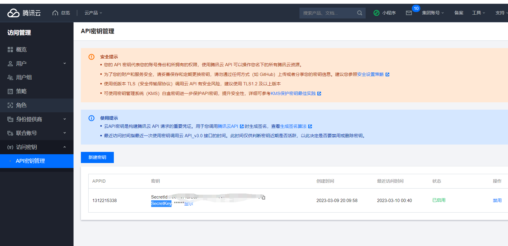

# 如何在抖音上找到漂亮小姐姐----抖音机器人

       

##  对原来的抖音机器人进行修改
没怎么学过python，写的不好话，随便看看吧

## 来源
- 参考 [Douyin-Bot](https://github.com/wangshub/Douyin-Bot)
- 在 [ai.qq.com](https://ai.qq.com) 中找到人脸识别，然后登入控制台即可免费领取一定额度
- 然后将得到的 `SecretId` 和 `SecretKey` 填入到 douyin-bot.py 中的 `AppID` 和 `AppKey` 中

## 更多问题
1、无法评论的原因 https://blog.csdn.net/taotao0001tao/article/details/124593407
2、face文件不存在
